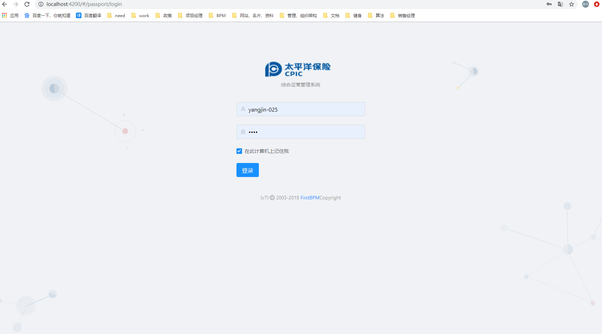

# 前端项目开发 

我们的前端项目是用NG-ALAIN企业级中后台前端/设计解决方案脚手架。

需要掌握的技术栈包含：Typescript、Angular、g2、@delon 和 ng-zorro-antd,想要更好的掌握项目的前端开发，了解掌握这些知识是非常有必要的。

这里具体的NG-ALAIN的使用可以看官网教程：<https://ng-alain.com/zh>

此文档，目的是帮助你们更加快速上手和开发项目；

- [了解目录结构](#Catalog)
- 如何新建表单
- 表单开发及注意事项

整个前端的开发很简单，并不需要你了解很多东西，主要是在表单的开发上。

<div id="Catalog"></div>
## 了解目录结构 

我们主要了解src下的目录内容，其他的部分有兴趣的可以自己研究下。

```
src
│   ├── app									 # 项目开发的所有页面组件
│   │   ├── actions
│   │   ├── common
│   │   ├── core                                # 核心模块
│   │   │   ├── http							# 后台加载模块
│   │   │   ├── net
│   │   │   │   └── default.interceptor.ts      # 默认HTTP拦截器
│   │   │   ├── services						# *** 所有的表单页面 ***
│   │   │   ├── startup						 # 用于刚启动时获取所需要的基础数据等
│   │   │   └── core.module.ts                  # 核心模块文件
│   │   ├── epics							   #
│   │   ├── layout                              # 通用布局
│   │   ├── models							  #
│   │   ├── reducers							#
│   │   ├── routes							  #
│   │   │   ├── **                              # 业务目录
│   │   │   ├── routes.module.ts                # 业务路由模块
│   │   │   └── routes-routing.module.ts        # 业务路由注册口
│   │   ├── shared                              # 共享模块
│   │   │   └── shared.module.ts                # 共享模块文件
│   │   ├── store							   #
│   │   ├── app.component.ts                    # 根组件
│   │   └── app.module.ts                       # 根模块
│   │   └── delon.module.ts                     # @delon模块导入
│   ├── assets                                  # 本地静态资源
│   ├── environments                            # 环境变量配置
│   │   ├── environment.hmr.ts				  # 热加载
│   │   ├── environment.prod.ts				 # 生产环境
│   │   └── environment.ts					  # 测试环境
│   ├── styles                                  # 样式目录
└── └── style.less                              # 样式引导入口
```

运行

```
npm start
```

启动完成后访问浏览器  http://localhost:4200, 如果出现这个画面说明成功了;


